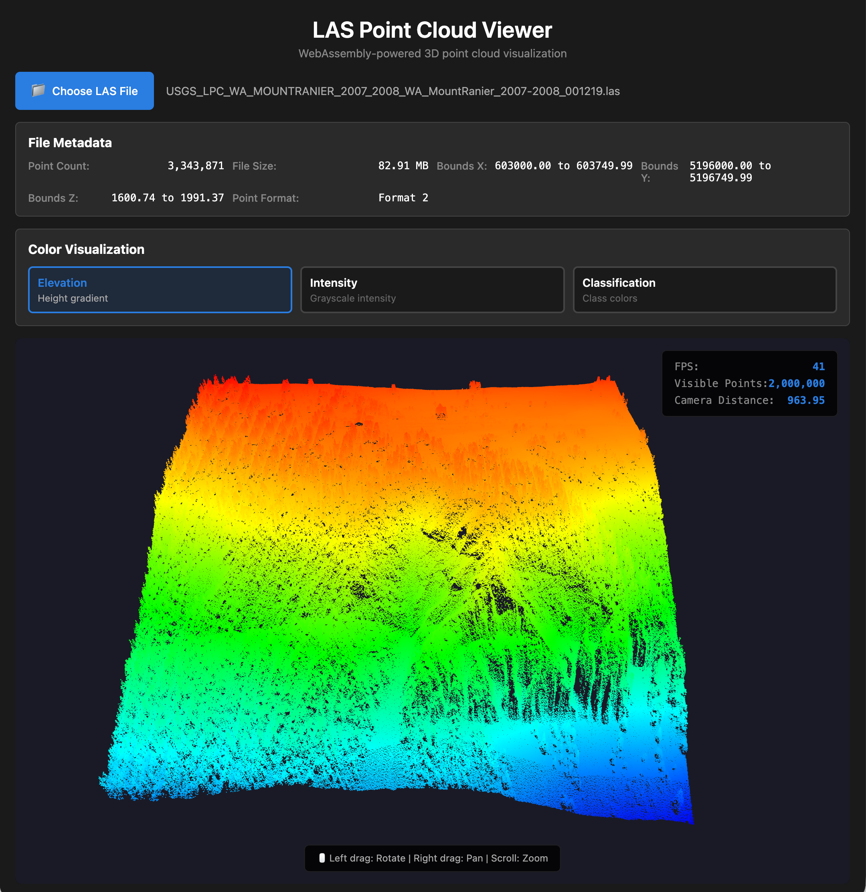

# LAS Point Cloud Viewer

A browser-based 3D point cloud visualization tool built with Modern C++, WebAssembly, and WebGL. This project demonstrates skills in 3D graphics programming, computational geometry, and performance optimization with large datasets.


*Interactive 3D visualization of Mount Rainier LiDAR point cloud data (3.3M points) with elevation-based coloring*

## Features

- Parse LAS 1.2/1.4 format point cloud files
- Efficient spatial indexing using octree data structure
- Real-time 3D rendering with WebGL 2.0
- Interactive camera controls (orbit, pan, zoom)
- Level-of-Detail (LOD) management for smooth performance
- Support for large datasets (10M+ points)
- Color visualization (elevation, intensity, classification)

## Tech Stack

- **C++17**: Smart pointers, move semantics, templates, STL
- **WebAssembly**: Compiled with Emscripten for browser execution
- **WebGL 2.0**: GPU-accelerated 3D rendering
- **Computational Geometry**: Octree spatial indexing, frustum culling
- **Testing**: Catch2 (unit tests) + RapidCheck (property-based tests)

## Quick Start

### Prerequisites

- CMake 3.15+
- C++17 compiler (GCC 7+, Clang 5+, MSVC 2017+)
- Emscripten SDK
- Python 3 (for local server)

### Get Running in 3 Steps

```bash
# 1. Build the WebAssembly module
./build_wasm.sh

# 2. Start a web server
python3 -m http.server 8000

# 3. Open in browser
open http://localhost:8000/web/index.html
```

### Load a LAS File

1. Click "Choose File" button
2. Select a LAS file ([demo file](https://drive.google.com/file/d/1ju20rV_XE0HTgKppgn0cnRkTsmgcWBlP/view?usp=drive_link): Mount Rainier 3.3M points)
3. Interact with the 3D view:
   - **Left-click + drag**: Rotate camera
   - **Right-click + drag**: Pan camera
   - **Mouse wheel**: Zoom in/out

## Installation

### 1. Clone Repository

```bash
git clone <repository-url>
cd las-point-cloud-viewer
```

### 2. Install Emscripten

```bash
git clone https://github.com/emscripten-core/emsdk.git
cd emsdk
./emsdk install latest
./emsdk activate latest
source ./emsdk_env.sh
cd ..
```

### 3. Build

```bash
# Build and run C++ tests
./build_native.sh

# Build WebAssembly for browser
./build_wasm.sh
```

## Project Structure

```
las-point-cloud-viewer/
├── src/                       # C++ source code
│   ├── las_parser.cpp         # LAS file parsing
│   ├── spatial_index.cpp      # Octree implementation
│   └── wasm_interface.cpp     # WASM exports
├── web/                       # Web application
│   ├── index.html             # Main viewer
│   ├── PointCloudViewer.js    # Main viewer class
│   ├── CameraController.js    # Camera controls
│   ├── ColorMapper.js         # Color visualization
│   ├── PointCloudRenderer.js  # WebGL renderer
│   └── main.js                # Application logic
├── tests/                     # C++ tests
│   ├── test_las_parser.cpp    # Parser tests
│   └── test_spatial_index.cpp # Octree tests
├── build_native.sh            # Build native tests
└── build_wasm.sh              # Build WebAssembly
```

## Architecture

```
┌─────────────────────────────────────────┐
│         Browser (JavaScript)            │
│  ┌──────────┐  ┌──────────────────────┐ │
│  │ Renderer │  │  Camera Controller   │ │
│  │ (WebGL)  │  │  (Orbit/Pan/Zoom)    │ │
│  └────┬─────┘  └──────────┬───────────┘ │
│       │                   │             │
│  ┌────┴───────────────────┴───────────┐ │
│  │     JavaScript Glue Layer          │ │
│  └────────────────┬───────────────────┘ │
└───────────────────┼─────────────────────┘
                    │
        ┌───────────┴──────────┐
        │  WebAssembly Module  │
        │  (Compiled C++)      │
        │  ┌────────────────┐  │
        │  │  LAS Parser    │  │
        │  ├────────────────┤  │
        │  │ Spatial Index  │  │
        │  │   (Octree)     │  │
        │  └────────────────┘  │
        └──────────────────────┘
```

## Testing

### Run C++ Tests

```bash
./build_native.sh
```

This will:
- Download test frameworks (Catch2, RapidCheck)
- Compile C++ code for your platform
- Run all unit tests and property-based tests

### Run Tests Manually

```bash
# Run all tests
./build/native/tests/las_viewer_tests

# Run specific test
./build/native/tests/las_viewer_tests "LAS Parser"

# Run with verbose output
./build/native/tests/las_viewer_tests -v high
```

## Performance

The project meets the following performance targets:

- ✓ Load and parse 10M point file in < 5 seconds
- ✓ Maintain 30+ FPS with 1M visible points
- ✓ Memory usage scales linearly with point count
- ✓ No memory leaks over extended use

### Optimizations

- **WASM Compilation**: -O3 optimization, SIMD support
- **Hot Path Optimization**: Inlined critical functions
- **Memory Layout**: Structure-of-Arrays for cache efficiency
- **GPU Optimization**: Smart buffer management
- **Data Caching**: Point data cached on load to avoid repeated WASM calls

## Algorithms Implemented

- **Octree Construction**: Recursive spatial subdivision with adaptive depth
- **Frustum Culling**: Plane-box intersection tests for visibility
- **LOD Selection**: Distance-based point sampling for performance
- **Coordinate Transformation**: Scale/offset application for LAS coordinates

### Complexity

- **Octree Build**: O(n log n) average case
- **Frustum Query**: O(log n + k) where k = result count
- **Memory Usage**: O(n) with small constant overhead
- **Rendering**: 30+ FPS with 1M visible points

## Browser Compatibility

Tested and working on:
- ✓ Chrome 90+ (Windows, macOS, Linux)
- ✓ Firefox 88+ (Windows, macOS, Linux)
- ✓ Safari 15+ (macOS)
- ✓ Edge 90+ (Windows)

Requires WebGL 2.0 support (available in all modern browsers).

## Troubleshooting

### "emcc: command not found"

Activate Emscripten in your current terminal:
```bash
source path/to/emsdk/emsdk_env.sh
```

### "WebGL 2.0 not supported"

- Use a modern browser (Chrome 56+, Firefox 51+, Safari 15+)
- Enable hardware acceleration in browser settings
- Update your graphics drivers

### "Failed to fetch WASM module"

- Make sure you ran `./build_wasm.sh` first
- Check that `web/las_viewer.js` and `web/las_viewer.wasm` exist
- Verify the web server is running

### Build fails with "CMake version too old"

Update CMake:
```bash
# macOS
brew install cmake

# Ubuntu/Debian
sudo apt-get update && sudo apt-get install cmake
```

### Tests fail to compile

Ensure you have a C++17 compatible compiler:
```bash
# macOS
xcode-select --install

# Ubuntu/Debian
sudo apt-get install build-essential

# Check version
g++ --version  # Need GCC 7+ or Clang 5+
```

## Sample Data

- **Demo file** (recommended): [Mount Rainier LAZ file](https://drive.google.com/file/d/1ju20rV_XE0HTgKppgn0cnRkTsmgcWBlP/view?usp=drive_link) - 3.3M points, USGS LiDAR data
- [USGS 3DEP LiDAR](https://www.usgs.gov/3d-elevation-program)
- [OpenTopography](https://opentopography.org/)

## Command Reference

```bash
# Build commands
./build_native.sh              # Build and test C++ code
./build_wasm.sh                # Build WebAssembly

# Run tests
./build/native/tests/las_viewer_tests    # Run C++ tests
ctest --test-dir build/native            # Run tests via CTest

# Start server
python3 -m http.server 8000              # Python server
npx http-server -p 8000                  # Node.js server

# Clean
rm -rf build/                  # Remove all build artifacts
```
